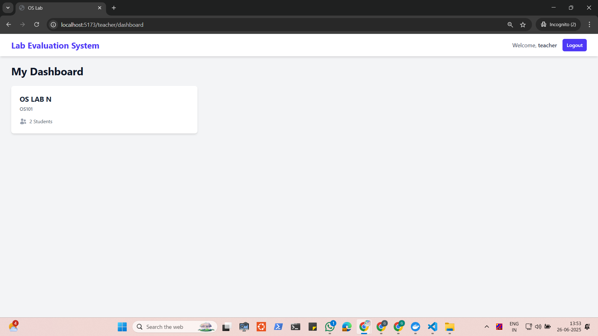

# OS-LAB COMPONENTS

- Frontend and Backend with auth

## To run this

### Prerequisites: Node, Docker, A Mongodb

1. Clone this repo
   ```bash
   git clone https://github.com/ganeshsprofessional/os-lab.git
   ```
2. Have a mongodb running, and paste the uri in the .env file in the backend
3. Navigate to the backend and install the dependencies
   ```bash
   cd backend && npm i
   ```
4. Run the backend
   ```bash
   npm run dev
   ```
5. Navigate to the frontend and install the dependencies
   ```bash
   cd frontend && npm i
   ```
6. Run the frontend
   ```bash
   npm run dev
7. Optionally, you can add dummy data to the db
   ```bash
   cd backend && node config/seedDB.js
   ```

## Student


## Teacher




